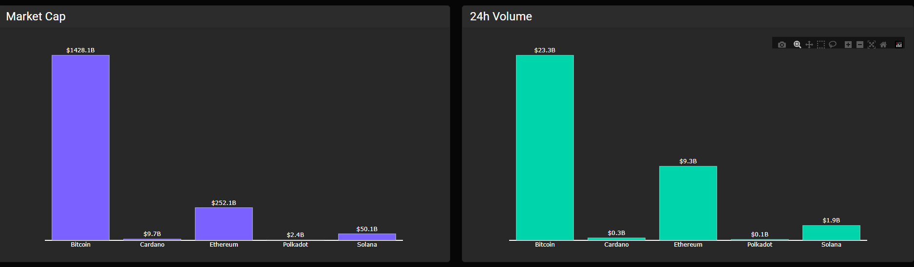
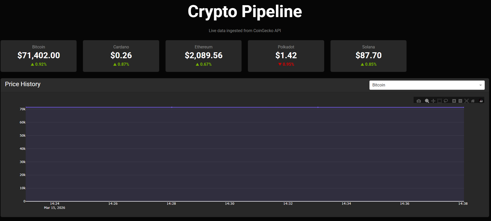

#  Crypto Pipeline

A production ready data ingestion pipeline that fetches real time cryptocurrency data from the CoinGecko API, stores it in PostgreSQL, and visualizes it through an interactive dashboard.


##  Overview

- **Ingestion**: Fetches live market data from CoinGecko API every 5 minutes
- **Storage**: Persists data in a PostgreSQL database with optimized schema
- **Visualization**: Interactive dashboard built with Plotly Dash

# Dashboard view




##  Tech Stack

- **Python 3.13** — Core language
- **PostgreSQL 16** — Data storage
- **Plotly Dash** — Interactive dashboard
- **Docker & Docker Compose** — Containerization
- **Pandas** — Data transformation
- **CoinGecko API** — Data source

## Features

- Real time KPI cards with price and 24h change
- Price history chart per coin
- Market cap and 24h volume comparison
- Auto refresh every 30 seconds
- Fully containerized — runs anywhere with Docker

##  Architecture
```
CoinGecko API
      ↓
Python Ingestion Pipeline (every 5 min)
      ↓
PostgreSQL Database
      ↓
Plotly Dash Dashboard (port 8050)
```

## Getting Started

### Prerequisites

- Docker
- Docker Compose

### Run the project
```bash
git clone https://github.com/rd6hckr/crypto-pipeline.git
cd crypto-pipeline
cp .env.example .env
docker compose up --build
```

Open your browser at `http://localhost:8050`

## ⚙️ Environment Variables

Create a `.env` file based on `.env.example`:
```env
POSTGRES_DB=cryptodb
POSTGRES_USER=cryptouser
POSTGRES_PASSWORD=your_password
POSTGRES_HOST=db
POSTGRES_PORT=5432
COINGECKO_API_URL=https://api.coingecko.com/api/v3
```


## Tracked Coins

Bitcoin, Ethereum, Solana, Cardano, Polkadot

##  License

MIT 